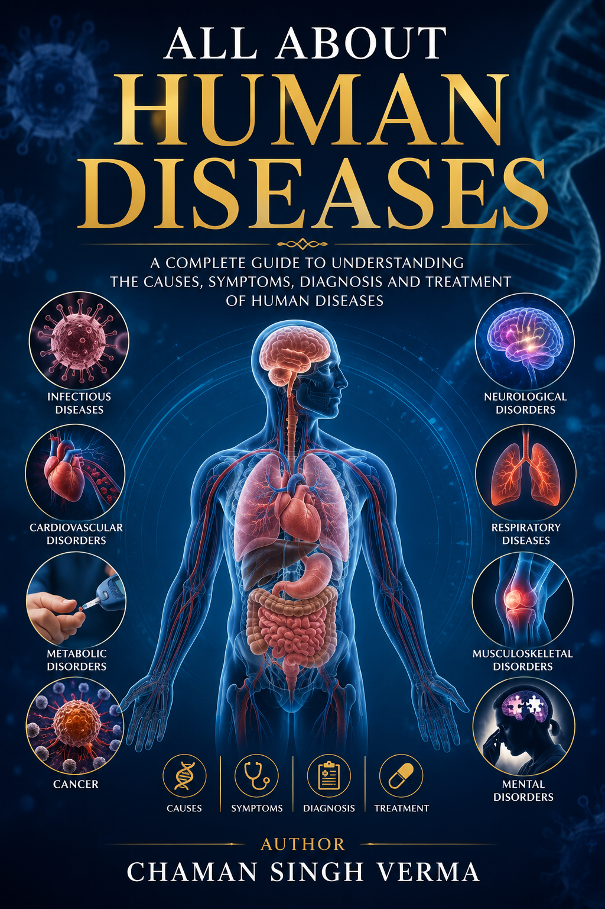

<p align="center">
  
</p>

[](human_diseases.pdf)
[](#-chapter-directory--content-breakdown)
[](#-chapter-directory--content-breakdown)
[](#-author--copyright)

**Author:** Chaman Singh Verma  
**Repository:** [github.com/csv610/human_diseases_book](https://github.com/csv610/human_diseases_book)  
**PDF Manuscript:** [human_diseases.pdf](human_diseases.pdf) *(393 Pages, 3.6 MB)*  

---

## 📖 Overview

***All About Human Diseases: An Organ-Categorized Medical Reference*** is an encyclopedic, high-yield medical textbook providing comprehensive coverage of **891 human diseases and clinical conditions** categorized across **31 primary organ systems** and medical specialties.

Designed for medical students (MBBS, MD, DO), board exam candidates (USMLE Step 1/2/3, PLAB, MRCP), physicians, and healthcare professionals, this volume unifies Internal Medicine, General Surgery, Pediatrics, Obstetrics & Gynecology, Neurology, Psychiatry, Dermatology, Toxicology, Geriatrics, and Pain Medicine into a single structured volume.

---

## ✨ Key Features & Unique Architecture

- **🔤 Dual-Axis Organization**: Categorized by primary anatomical organ system macro-level, with **100% strict alphabetical sorting** of all 199 sections and 891 subsections.
- **🎯 Standardized Clinical Framework**: Every disease entry adheres to a non-redundant 6-part medical structure:
  $$\text{Etiology} \longrightarrow \text{Pathophysiology} \longrightarrow \text{Clinical Features} \longrightarrow \text{Diagnostics} \longrightarrow \text{Management} \longrightarrow \text{Prognosis}$$
- **🧠 100% Section-Level Overviews**: Every single section features an introductory summary paragraph establishing physiological context and classification logic before listing specific diseases.
- **⚙️ Professional LaTeX Typesetting**: Typeset in Computer Modern (`book` class) with dynamic running headers (`fancyhdr`), left-aligned chapter titles (`titlesec`), full hyperlinked Table of Contents, and hyperlinked subject Index (`makeindex`).
- **🎨 High-Resolution Front Cover**: Custom full-page front cover artwork integrated as page 1.

---

## 📊 Chapter Directory & Content Breakdown

| Chapter | Organ System / Specialty | Sections | Subsections (Diseases) |
| :-: | :--- | :-: | :-: |
| **1** | Brain and Nervous System Diseases | 10 | 40 |
| **2** | Diseases of the Eyes | 9 | 23 |
| **3** | Diseases of the Ears | 4 | 15 |
| **4** | Diseases of the Nose and Sinuses | 3 | 14 |
| **5** | Diseases of the Throat and Oral Cavity | 4 | 17 |
| **6** | Diseases of the Heart and Cardiovascular System | 8 | 31 |
| **7** | Diseases of the Lungs and Respiratory System | 6 | 24 |
| **8** | Diseases of the Blood and Hematopoietic System | 5 | 27 |
| **9** | Diseases of the Lymphatic and Immune System | 5 | 18 |
| **10** | Diseases of the Spleen | 6 | 12 |
| **11** | Diseases of the Bones and Joints | 7 | 28 |
| **12** | Diseases of the Muscles | 4 | 15 |
| **13** | Systemic Autoimmune and Connective Tissue Diseases | 5 | 26 |
| **14** | Diseases of the Skin | 10 | 35 |
| **15** | Diseases of the Breast | 2 | 18 |
| **16** | Diseases of the Endocrine System | 4 | 20 |
| **17** | Diseases of the Pancreas | 4 | 16 |
| **18** | Diseases of the Stomach | 5 | 18 |
| **19** | Diseases of the Intestines | 8 | 16 |
| **20** | Diseases of the Liver | 7 | 18 |
| **21** | Diseases of the Kidneys and Urinary System | 10 | 23 |
| **22** | Diseases of the Reproductive Organs | 2 | 20 |
| **23** | Obstetric and Gynecologic Conditions | 8 | 51 |
| **24** | Nutritional and Metabolic Disorders | 6 | 42 |
| **25** | Pediatric and Neonatal Diseases | 6 | 56 |
| **26** | Geriatric Medicine and Aging-Related Disorders | 10 | 38 |
| **27** | Psychiatric and Mental Health Disorders | 13 | 35 |
| **28** | Systemic Infectious Diseases | 9 | 70 |
| **29** | Toxicology, Poisoning, and Environmental Medicine | 6 | 45 |
| **30** | Sleep Medicine and Sleep Disorders | 7 | 37 |
| **31** | Pain Medicine and Headache Disorders | 6 | 43 |
| **TOTAL** | **31 Chapters** | **199 Sections** | **891 Subsections** |

---

## 📂 Repository Structure

```
human_diseases_book/
├── chapters/              # 31 Organ System Chapter LaTeX files (.tex)
│   ├── blood.tex
│   ├── bones.tex
│   ├── brain.tex
│   └── ... (28 additional chapter files)
├── frontpage.png          # High-Resolution Book Cover Artwork
├── human_diseases.tex     # Master LaTeX Source & Configuration File
├── human_diseases.pdf     # Compiled Final Book PDF (383 pages)
├── .gitignore             # Git Ignore Configuration for LaTeX Build Files
└── README.md              # Project Documentation
```

---

## 🛠️ Local Compilation Instructions

To build the PDF manuscript locally using `pdflatex` and `makeindex`:

### Prerequisites
- TeX Live / MikTeX distribution (`pdflatex`, `makeindex`)
- Required TeX packages: `geometry`, `fancyhdr`, `titlesec`, `hyperref`, `pdfpages`, `makeidx`, `microtype`, `tabularx`, `amsmath`

### Build Commands

```bash
# Clone the repository
git clone git@github.com:csv610/human_diseases_book.git
cd human_diseases_book

# Compile PDF (Pass 1)
pdflatex -interaction=nonstopmode human_diseases.tex

# Generate Index
makeindex human_diseases.idx

# Compile PDF (Pass 2 - Resolve Cross-References & Index)
pdflatex -interaction=nonstopmode human_diseases.tex
```

---

## 👤 Author & Copyright

**Author:** Chaman Singh Verma  
**Copyright:** © 2026 Chaman Singh Verma. All rights reserved.  

*Medical Disclaimer: This publication is intended solely for educational, academic, and reference purposes. It does not constitute medical advice or substitute for clinical judgment by a licensed healthcare professional.*
